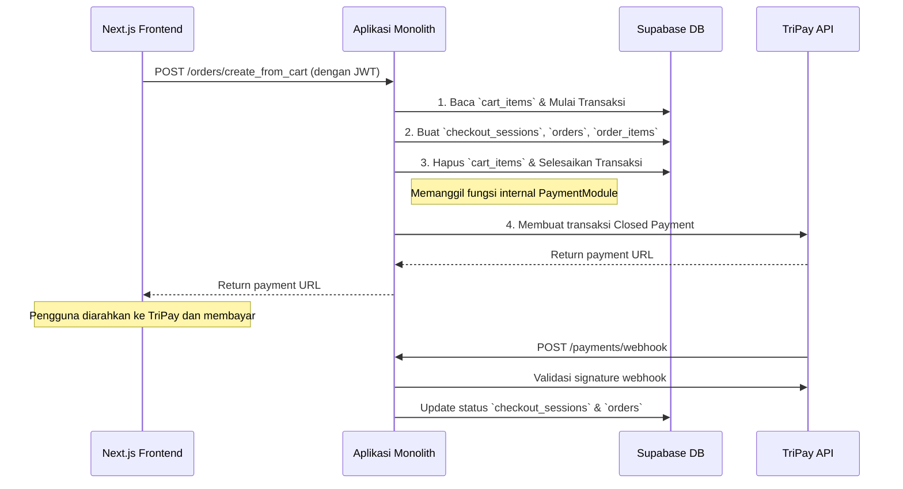

# `02-TECHNICAL-ARCHITECTURE.md`

## Panduan Arsitektur Teknis - PanenHub Web App

Dokumen ini menjelaskan arsitektur teknis, tumpukan teknologi (tech stack), dan alur data untuk platform PanenHub. Tujuannya adalah memberikan panduan yang jelas bagi tim developer untuk membangun sistem yang andal, skalabel, dan berperforma tinggi.

> **Catatan Status Saat Ini:** Dokumen ini menguraikan arsitektur yang sedang diimplementasikan. Backend service sudah terintegrasi dengan Supabase untuk autentikasi dan penyimpanan data. Beberapa fitur kunci seperti manajemen toko dan produk sudah berfungsi, sementara fitur lain seperti integrasi pembayaran masih dalam pengembangan.

---

### 1. Filosofi Arsitektur: Monolith Terstruktur untuk Kecepatan MVP

Kita mengadopsi pendekatan pragmatis yang memprioritaskan kecepatan rilis MVP. Logika bisnis backend dibangun sebagai **satu aplikasi monolitik yang terstruktur dengan baik**, yang di-deploy sebagai **satu layanan tunggal di Google Cloud Run**.

**Alasan Pendekatan Ini:**
* **Pengembangan Super Cepat:** Mengeliminasi kompleksitas komunikasi antar layanan dan manajemen multi-repo/multi-layanan, memungkinkan tim untuk fokus membangun fitur.
* **Deployment Sederhana:** Hanya ada satu *pipeline* CI/CD dan satu layanan untuk dikelola.
* **Evolusi di Masa Depan:** Arsitektur monolit ini dirancang secara modular. Jika di masa depan ada bagian yang menjadi *bottleneck*, kita bisa dengan mudah mengekstraknya menjadi *microservice* terpisah.

1.  **Frontend (Jamstack):** Aplikasi web kita dibangun menggunakan **Next.js (React)**. Ini memungkinkan kita untuk mendapatkan yang terbaik dari dua dunia:
    *   **Static Site Generation (SSG):** Halaman yang datanya relatif statis seperti halaman detail produk (`/products/[id]`) dan halaman toko (`/store/[storeId]`) di-pre-render saat build menggunakan `generateStaticParams`. Ini memberikan performa pemuatan awal yang sangat cepat.
    *   **Server-Side Rendering (SSR):** Halaman yang memerlukan data yang lebih dinamis di-render di sisi server, memberikan **SEO (Search Engine Optimization)** yang baik.
    *   **Client-Side Rendering (CSR):** Interaksi dinamis seperti di dalam dashboard "Toko Saya" (`/dashboard/*`), keranjang belanja (`/cart`), dan halaman akun (`/account`) ditangani di sisi klien, memberikan pengalaman layaknya Single Page Application (SPA).

2.  **Backend (Monolith Terstruktur):** Backend kita terdiri dari dua lapisan utama yang menyediakan API untuk frontend:
    *   **Supabase sebagai Data & Auth API:** Berfungsi sebagai *Single Source of Truth* untuk data dan otentikasi. Sudah terintegrasi dan berfungsi untuk:
        - Autentikasi pengguna (signup, login, reset password)
        - Manajemen profil pengguna
        - CRUD operasi untuk toko dan produk
        - Manajemen pesanan dan keranjang belanja
    *   **GCP sebagai Business Logic API:** Logika bisnis kompleks (pemrosesan pesanan, pembayaran, dll.) di-deploy sebagai **satu aplikasi monolith di Google Cloud Run**.

**Alasan Pendekatan Ini:**
*   **Performa & SEO Unggul:** Dengan Next.js, web app kita akan cepat dan ramah mesin pencari.
*   **Skalabilitas Independen:** Frontend dan backend dapat diskalakan secara independen sesuai beban.
*   **Keamanan:** Kunci API pihak ketiga tersimpan aman di backend GCP, tidak pernah terekspos ke browser klien.

---

### 2. Diagram Arsitektur Sistem (Target)

```mermaid
graph TD
    subgraph "Pengguna"
        A[Browser Pengguna (Desktop/Mobile)]
    end

    subgraph "Frontend Layer (Vercel)"
        B[Next.js Web App]
    end

    subgraph "Backend Layer (GCP)"
        C[Cloud Run: **Aplikasi Backend Monolith (Node.js)**]
        end

    subgraph "Data Hub (Supabase)"
        D[Supabase (Auth, DB, Storage)]
    end

    subgraph "Layanan Pihak Ketiga"
        E[TriPay API]
    end

    A -- Akses Situs --> B
    B -- Panggilan API (HTTP) --> C
    C -- Query/Auth/Storage --> D
    C -- Proses Pembayaran --> E
    E -- Webhook --> C
```

---

### 3. Tumpukan Teknologi (Tech Stack)

| Kategori | Teknologi / Layanan | Status | Fungsi Utama |
| :--- | :--- | :--- |:--- |
| **Aplikasi Web (Frontend)** | **Next.js (React)** | **Digunakan** | Membangun aplikasi web yang cepat, SEO-friendly, dan responsif. |
| **Hosting Frontend** | **Vercel** | **Digunakan** | Platform hosting global yang teroptimasi untuk aplikasi Next.js. |
| **Database & Auth** | **Supabase Cloud** | **Digunakan** | Database (PostgreSQL), Otentikasi Pengguna, Penyimpanan File, Realtime API. |
| **Backend Services** | **Google Cloud Run** | **Digunakan** | Menjalankan aplikasi backend monolith untuk logika bisnis. |
| **Layanan Pembayaran** | **TriPay API** | **Dalam Integrasi** | Memproses transaksi pembayaran dan menerima notifikasi webhook. |
| **Layanan Notifikasi** | **Firebase Cloud Messaging (FCM)** | **Direncanakan** | Mengirim push notification ke browser pengguna. |
| **Styling** | **Tailwind CSS** | **Digunakan** | Framework CSS utility-first untuk membangun desain kustom. |
| **State Management** | **Zustand** | **Digunakan** | Mengelola state global aplikasi (keranjang belanja, sesi pengguna, state UI). |
| **Manajemen Formulir** | **React Hook Form** | **Digunakan** | Untuk validasi dan manajemen state pada formulir. |
| **Ikonografi** | **Lucide Icons** | **Digunakan** | Menyediakan set ikon yang konsisten dan ringan. |

---

### 4. Struktur Database & Tabel Kunci (Target di Supabase)

RLS (Row Level Security) harus diaktifkan untuk semua tabel. Struktur ini adalah **target** untuk model e-commerce multi-vendor.

*   `profiles`
    *   `id` (uuid, references auth.users), `email` (text), `full_name` (text), `avatar_url` (text), **`is_seller` (boolean, default: false)**.

*   `stores`
    *   `id` (uuid), `owner_id` (uuid, references profiles), `store_name` (text), `description` (text), `banner_url` (text), `location` (geography).

*   `products`
    *   `id` (uuid), **`store_id` (uuid, references stores)**, `title` (text), `description` (text), `price` (numeric), `unit` (text), `stock` (integer), `image_urls` (text[]).

*   `carts` & `cart_items`
    *   Menangani state keranjang belanja pengguna yang persisten di database.

*   `checkout_sessions`
    *   `id` (uuid), `user_id` (uuid, references profiles), `total_amount` (numeric), `payment_status` (enum: `pending`, `paid`, `failed`).
    *   Menghubungkan satu checkout dengan beberapa pesanan.

*   `orders`
    *   `id` (uuid), **`checkout_session_id` (uuid, references checkout_sessions)**, `buyer_id` (uuid, references profiles), **`store_id` (uuid, references stores)**, `total_amount` (numeric), `shipping_status` (enum: `processing`, `shipped`, `delivered`, `cancelled`).

*   `order_items`
    *   `id` (uuid), `order_id` (uuid, references orders), `product_id` (uuid, references products), `quantity` (integer), `price_at_purchase` (numeric).

*   `device_tokens` (Untuk Web Push Notifications)
    *   `id` (uuid), `user_id` (uuid, references profiles), **`token_info` (jsonb)** - Menyimpan objek langganan Web Push dari browser.

---

### 5. Aturan Lingkungan & Manajemen API Key

*   **Lingkungan Tunggal (`panenhub-mvp`):** Targetnya adalah satu project Supabase dan satu project GCP untuk menyederhanakan manajemen.
*   **Manajemen API Key:** Semua kunci API (TriPay, Supabase Service Key, dll.) **WAJIB** disimpan di **Google Secret Manager**. Tidak boleh ada kunci di dalam kode atau variabel lingkungan di Vercel. Aplikasi monolith di Cloud Run akan mengambilnya saat runtime.

---

### 6. Alur Data Kritis: "Checkout Keranjang Belanja" (Target)

*Tujuan: Menjelaskan bagaimana data akan mengalir melalui arsitektur untuk alur pembelian yang aman.*



---

### 7. Checklist Setup Lingkungan Kerja

*   **Setup Frontend:**
    1.  [ ] `git clone` repositori frontend.
    2.  [ ] Jalankan `npm install`.
    3.  [ ] Salin `.env.example` ke `.env` dan isi dengan kredensial Supabase:
        ```
        NEXT_PUBLIC_SUPABASE_URL=https://your-project.supabase.co
        NEXT_PUBLIC_SUPABASE_ANON_KEY=your-anon-key
        ```
    4.  [ ] Jalankan `npm run dev`. Aplikasi web akan berjalan di `localhost:3000`.

*   **Setup Backend:**
    1.  [ ] `git clone` repositori backend monolith.
    2.  [ ] Jalankan `npm install`.
    3.  [ ] Salin `.env.example` ke `.env` dan isi dengan kredensial yang diperlukan:
        ```
        PORT=8080
        SUPABASE_URL=https://your-project.supabase.co
        SUPABASE_SERVICE_KEY=your-service-key
        TRIPAY_API_KEY=your-tripay-key
        TRIPAY_PRIVATE_KEY=your-tripay-private-key
        ```
    4.  [ ] Jalankan `npm run dev`. Aplikasi backend akan berjalan di `localhost:8080`.

*   **Setup Database & Auth:**
    1.  [ ] Akses dashboard Supabase dan buat project baru.
    2.  [ ] Jalankan SQL migration untuk membuat skema database:
        ```sql
        -- Jalankan script dari sql-functions.sql
        ```
    3.  [ ] Aktifkan autentikasi email/password di Supabase Authentication.
    4.  [ ] Setup Row Level Security (RLS) policies untuk setiap tabel.

*   **Setup Deployment:**
    1.  [ ] Setup project di Google Cloud Platform.
    2.  [ ] Aktifkan Cloud Run dan Container Registry.
    3.  [ ] Setup GitHub Actions untuk CI/CD ke Cloud Run.
    4.  [ ] Setup domain dan SSL di Vercel untuk frontend.